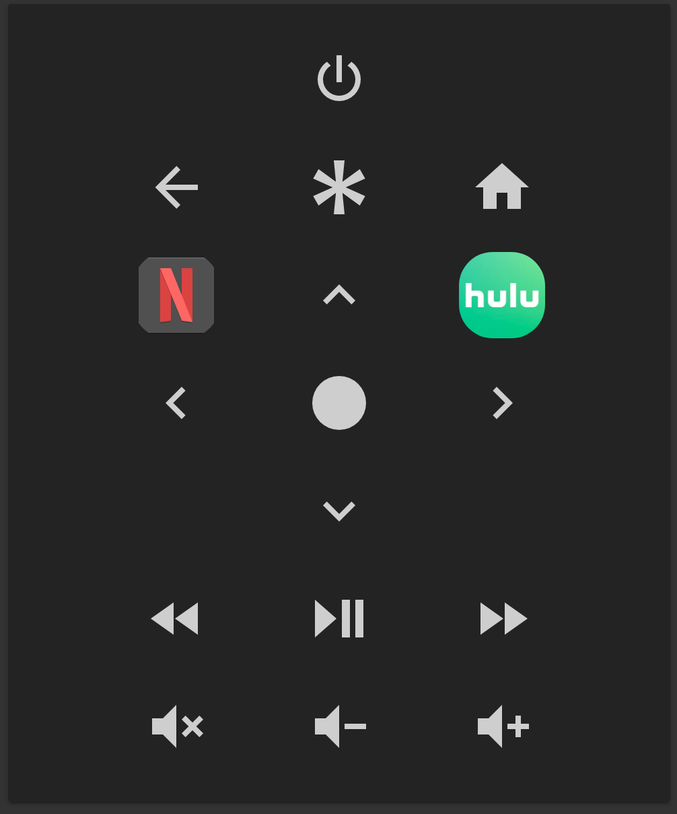

# 📺 Roku Remote Card

[![GitHub Release][releases-shield]][releases]
[![License][license-shield]](LICENSE.md)
[](https://github.com/custom-components/hacs)

![Project Maintenance][maintenance-shield]
[![GitHub Activity][commits-shield]][commits]

[![Discord][discord-shield]][discord]
[![Community Forum][forum-shield]][forum]

[![Twitter][twitter]][twitter]
[![Github][github]][github]

## Support

Hey dude! Help me out for a couple of :beers: or a :coffee:!

[](https://www.buymeacoffee.com/zJtVxUAgH)

This card is for [Lovelace](https://www.home-assistant.io/lovelace) on [Home Assistant](https://www.home-assistant.io/) that display a [Roku](https://www.roku.com/) remote.



## Installation

# Version 1.1.0 and above require Home Assistant 0.110.0 or above

Use [HACS](https://hacs.xyz) or follow this [guide](https://github.com/thomasloven/hass-config/wiki/Lovelace-Plugins)

```yaml
resources:
  url: /local/roku-card.js
  type: module
```

## Options

| Name        | Type      | Requirement  | Description                                                                |
| ----------- | --------- | ------------ | -------------------------------------------------------------------------- |
| type        | `string`  | **Required** | `custom:roku-card`                                                         |
| entity      | `string`  | **Required** | `media_player` entity of Roku device                                       |
| remote      | `string`  | **Optional** | `remote` entity of Roku device. Default assumed named like `entity`        |
| name        | `string`  | **Optional** | Card name                                                                  |
| theme       | `string`  | **Optional** | Card theme                                                                 |
| tv          | `boolean` | **Optional** | If `true` shows volume and power buttons. Default `false`                  |
| power       | `map`     | **Optional** | Button configuration for power [See button options](#button-options)       |
| volume_up   | `map`     | **Optional** | Button configuration for volume_up [See button options](#button-options)   |
| volume_down | `map`     | **Optional** | Button configuration for volume_down [See button options](#button-options) |
| volume_mute | `map`     | **Optional** | Button configuration for volume_mute [See button options](#button-options) |
| up          | `map`     | **Optional** | Button configuration for up [See button options](#button-options)          |
| down        | `map`     | **Optional** | Button configuration for down [See button options](#button-options)        |
| left        | `map`     | **Optional** | Button configuration for left [See button options](#button-options)        |
| right       | `map`     | **Optional** | Button configuration for right [See button options](#button-options)       |
| home        | `map`     | **Optional** | Button configuration for home [See button options](#button-options)        |
| info        | `map`     | **Optional** | Button configuration for info [See button options](#button-options)        |
| back        | `map`     | **Optional** | Button configuration for back [See button options](#button-options)        |
| select      | `map`     | **Optional** | Button configuration for select [See button options](#button-options)      |
| reverse     | `map`     | **Optional** | Button configuration for reverse [See button options](#button-options)     |
| play        | `map`     | **Optional** | Button configuration for play [See button options](#button-options)        |
| forward     | `map`     | **Optional** | Button configuration for forward [See button options](#button-options)     |
| apps        | `map`     | **Optional** | List of app shortcuts [See app options](#app-options)                      |

## app Options

| Name              | Type     | Requirement  | Description                                                 |
| ----------------- | -------- | ------------ | ----------------------------------------------------------- |
| app               | `string` | **Optional** | Name of the source to launch as `tap_action`                |
| image             | `string` | **Optional** | Path to image to use for app                                |
| icon              | `string` | **Optional** | mdi icon to use instead of an image for app                 |
| tap_action        | `map`    | **Optional** | Tap action map [See action options](#action-options)        |
| hold_action       | `map`    | **Optional** | Hold action map [See action options](#action-options)       |
| double_tap_action | `map`    | **Optional** | Doulbe Tap action map [See action options](#action-options) |

## button Options

| Name              | Type      | Requirement  | Description                                                 |
| ----------------- | --------- | ------------ | ----------------------------------------------------------- |
| show              | `boolean` | **Optional** | Show/Hide button `true`                                     |
| tap_action        | `map`     | **Optional** | Tap action map [See action options](#action-options)        |
| hold_action       | `map`     | **Optional** | Hold action map [See action options](#action-options)       |
| double_tap_action | `map`     | **Optional** | Doulbe Tap action map [See action options](#action-options) |

## action Options

| Name              | Type     | Default  | Supported options                                                        | Description                                                                                               |
| ----------------- | -------- | -------- | ------------------------------------------------------------------------ | --------------------------------------------------------------------------------------------------------- |
| `action`          | `string` | `toggle` | `more-info`, `toggle`, `call-service`, `none`, `navigate`, `url`         | Action to perform                                                                                         |
| `entity`          | `string` | none     | Any entity id                                                            | **Only valid for `action: more-info`** to override the entity on which you want to call `more-info`       |
| `navigation_path` | `string` | none     | Eg: `/lovelace/0/`                                                       | Path to navigate to (e.g. `/lovelace/0/`) when action defined as navigate                                 |
| `url_path`        | `string` | none     | Eg: `https://www.google.com`                                             | URL to open on click when action is `url`.                                                                |
| `service`         | `string` | none     | Any service                                                              | Service to call (e.g. `media_player.media_play_pause`) when `action` defined as `call-service`            |
| `service_data`    | `map`    | none     | Any service data                                                         | Service data to include (e.g. `entity_id: media_player.bedroom`) when `action` defined as `call-service`. |
| `haptic`          | `string` | none     | `success`, `warning`, `failure`, `light`, `medium`, `heavy`, `selection` | Haptic feedback for the [Beta IOS App](http://home-assistant.io/ios/beta)                                 |
| `repeat`          | `number` | none     | eg: `500`                                                                | How often to repeat the `hold_action` in milliseconds.                                                    |

## Usage

```yaml
type: 'custom:roku-card'
entity: media_player.basement_roku
tv: true
apps:
  - image: /local/netflix.webp
    app: Netflix
  - image: /local/hulu.webp
    app: Hulu
    hold_action:
      action: call-service
      service: media_player.select_source
      service_data:
        source: ESPN
        entity_id: media_player.basement_roku
volume_up:
  tap_action:
    action: call-service
    service: remote.send_command
    service_data:
      entity_id: remote.basement_roku
      command: play
volume_down:
  double_tap_action:
    action: call-service
    service: remote.send_command
    service_data:
      entity_id: remote.basement_roku
      command: play
```

[Troubleshooting](https://github.com/thomasloven/hass-config/wiki/Lovelace-Plugins)

## Developers

1. Fork and clone the repository.
2. Open the [devcontainer][devcontainer] and run `npm start` when it's ready.
3. The compiled `.js` file will be accessible on
   `http://127.0.0.1:5000/roku-card.js`.
4. On a running Home Assistant installation add this to your Lovelace
   `resources:`

```yaml
- url: 'http://127.0.0.1:5000/roku-card.js'
  type: module
```

_Change "127.0.0.1" to the IP of your development machine._

### Bonus

If you need a fresh test instance you can install a fresh Home Assistant instance inside the devcontainer as well.

1. Run the command `dc start`.
2. Home Assistant will install and will eventually be running on port `9123`

[commits-shield]: https://img.shields.io/github/commit-activity/y/iantrich/roku-card.svg?style=for-the-badge
[commits]: https://github.com/iantrich/roku-card/commits/master
[devcontainer]: https://code.visualstudio.com/docs/remote/containers
[discord]: https://discord.gg/Qa5fW2R
[discord-shield]: https://img.shields.io/discord/330944238910963714.svg?style=for-the-badge
[forum-shield]: https://img.shields.io/badge/community-forum-brightgreen.svg?style=for-the-badge
[forum]: https://community.home-assistant.io/t/lovelace-roku-remote-card/91476
[license-shield]: https://img.shields.io/github/license/iantrich/roku-card.svg?style=for-the-badge
[maintenance-shield]: https://img.shields.io/badge/maintainer-Ian%20Richardson%20%40iantrich-blue.svg?style=for-the-badge
[releases-shield]: https://img.shields.io/github/release/iantrich/roku-card.svg?style=for-the-badge
[releases]: https://github.com/iantrich/roku-card/releases
[twitter]: https://img.shields.io/twitter/follow/iantrich.svg?style=social
[github]: https://img.shields.io/github/followers/iantrich.svg?style=social
